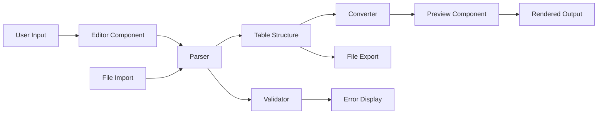

# Design Document: Markdown ↔ TOON Converter

## Overview

Este documento describe el diseño de una aplicación React + TypeScript que proporciona conversión bidireccional entre Markdown y TOON (Token-Oriented Object Notation), junto con un editor interactivo con preview en tiempo real.

### Objetivos del Sistema

1. **Conversión Bidireccional**: Transformar tablas y listas entre Markdown y TOON preservando la estructura de datos
2. **Editor Interactivo**: Proporcionar una interfaz visual para crear y editar archivos TOON
3. **Validación en Tiempo Real**: Detectar y reportar errores de sintaxis inmediatamente
4. **Preview Múltiple**: Visualizar contenido en formatos Markdown, HTML y JSON
5. **Gestión de Archivos**: Importar y exportar archivos en múltiples formatos
6. **Métricas de Eficiencia**: Calcular y mostrar ahorro de tokens

### Tecnologías Principales

- **React 18+**: Framework de UI con hooks y componentes funcionales
- **TypeScript 5+**: Tipado estático para mayor seguridad
- **Vite**: Build tool y dev server rápido
- **Monaco Editor** o **CodeMirror**: Editor de código con syntax highlighting
- **Marked.js**: Parser de Markdown
- **DOMPurify**: Sanitización de HTML

## Architecture

### Arquitectura de Capas

```
┌─────────────────────────────────────────────────────────┐
│                    Presentation Layer                    │
│  ┌──────────────┐  ┌──────────────┐  ┌──────────────┐  │
│  │   Editor     │  │   Preview    │  │   Controls   │  │
│  │  Component   │  │  Component   │  │  Component   │  │
│  └──────────────┘  └──────────────┘  └──────────────┘  │
└─────────────────────────────────────────────────────────┘
                          │
┌─────────────────────────────────────────────────────────┐
│                    Application Layer                     │
│  ┌──────────────┐  ┌──────────────┐  ┌──────────────┐  │
│  │   Converter  │  │  Validator   │  │   Metrics    │  │
│  │   Service    │  │   Service    │  │   Service    │  │
│  └──────────────┘  └──────────────┘  └──────────────┘  │
└─────────────────────────────────────────────────────────┘
                          │
┌─────────────────────────────────────────────────────────┐
│                      Domain Layer                        │
│  ┌──────────────┐  ┌──────────────┐  ┌──────────────┐  │
│  │   Markdown   │  │     TOON     │  │    Table     │  │
│  │    Parser    │  │    Parser    │  │   Structure  │  │
│  └──────────────┘  └──────────────┘  └──────────────┘  │
└─────────────────────────────────────────────────────────┘
```

### Flujo de Datos



### Separación de Responsabilidades

1. **Presentation Layer**: Componentes React que manejan UI y eventos de usuario
2. **Application Layer**: Servicios que coordinan lógica de negocio
3. **Domain Layer**: Parsers y estructuras de datos core sin dependencias de UI

## Components and Interfaces

### Core Interfaces

```typescript
// Estructura de datos central para representar tablas
interface TableStructure {
  name: string;
  columns: string[];
  rows: string[][];
}

// Resultado de parsing con manejo de errores
interface ParseResult<T> {
  success: boolean;
  data?: T;
  errors: ParseError[];
  warnings: ParseWarning[];
}

interface ParseError {
  line: number;
  column: number;
  message: string;
  severity: 'error' | 'warning' | 'info';
}

interface ParseWarning {
  line: number;
  message: string;
}

// Configuración de conversión
interface ConversionOptions {
  generateTableNames: boolean;
  escapeSpecialChars: boolean;
  preserveFormatting: boolean;
  defaultTablePrefix: string;
}

// Métricas de eficiencia
interface TokenMetrics {
  toonTokens: number;
  markdownTokens: number;
  savingsPercent: number;
  toonBytes: number;
  markdownBytes: number;
}
```

### Parser Interfaces

```typescript
// Parser de Markdown
interface MarkdownParser {
  parse(content: string): ParseResult<TableStructure[]>;
  extractTables(content: string): TableStructure[];
  extractLists(content: string): TableStructure[];
}

// Parser de TOON
interface ToonParser {
  parse(content: string): ParseResult<TableStructure[]>;
  validate(content: string): ParseError[];
  format(tables: TableStructure[]): string;
}
```

### Converter Interface

```typescript
interface Converter {
  markdownToToon(markdown: string, options?: ConversionOptions): string;
  toonToMarkdown(toon: string, options?: ConversionOptions): string;
  tablesToToon(tables: TableStructure[]): string;
  tablesToMarkdown(tables: TableStructure[]): string;
}
```

### Component Interfaces

```typescript
// Props del Editor
interface EditorProps {
  initialContent: string;
  onChange: (content: string) => void;
  onValidate: (errors: ParseError[]) => void;
  language: 'toon' | 'markdown';
  readOnly?: boolean;
}

// Props del Preview
interface PreviewProps {
  content: string;
  mode: 'markdown' | 'html' | 'json';
  tables: TableStructure[];
}

// Props de controles
interface ControlsProps {
  onImport: (file: File) => void;
  onExport: (format: 'toon' | 'markdown' | 'html') => void;
  onTemplateSelect: (template: string) => void;
  onClear: () => void;
}
```

## Data Models

### TableStructure Model

```typescript
class TableStructure {
  constructor(
    public name: string,
    public columns: string[],
    public rows: string[][]
  ) {
    this.validate();
  }

  validate(): void {
    if (!this.name || this.name.trim() === '') {
      throw new Error('Table name cannot be empty');
    }
    
    if (this.columns.length === 0) {
      throw new Error('Table must have at least one column');
    }
    
    for (const row of this.rows) {
      if (row.length !== this.columns.length) {
        throw new Error(
          `Row has ${row.length} cells but table has ${this.columns.length} columns`
        );
      }
    }
  }

  toToon(): string {
    const header = `--- ${this.name}`;
    const columnRow = this.columns.join(' | ');
    const dataRows = this.rows.map(row => row.join(' | ')).join('\n');
    return `${header}\n${columnRow}\n${dataRows}`;
  }

  toMarkdown(): string {
    const header = `## ${this.name}\n\n`;
    const columnRow = '| ' + this.columns.join(' | ') + ' |';
    const separator = '| ' + this.columns.map(() => '---').join(' | ') + ' |';
    const dataRows = this.rows
      .map(row => '| ' + row.join(' | ') + ' |')
      .join('\n');
    return `${header}${columnRow}\n${separator}\n${dataRows}`;
  }

  clone(): TableStructure {
    return new TableStructure(
      this.name,
      [...this.columns],
      this.rows.map(row => [...row])
    );
  }

  equals(other: TableStructure): boolean {
    if (this.name !== other.name) return false;
    if (this.columns.length !== other.columns.length) return false;
    if (this.rows.length !== other.rows.length) return false;
    
    for (let i = 0; i < this.columns.length; i++) {
      if (this.columns[i] !== other.columns[i]) return false;
    }
    
    for (let i = 0; i < this.rows.length; i++) {
      for (let j = 0; j < this.rows[i].length; j++) {
        if (this.rows[i][j] !== other.rows[i][j]) return false;
      }
    }
    
    return true;
  }
}
```

### Parser Implementation Strategy

#### TOON Parser

```typescript
class ToonParserImpl implements ToonParser {
  parse(content: string): ParseResult<TableStructure[]> {
    const tables: TableStructure[] = [];
    const errors: ParseError[] = [];
    const warnings: ParseWarning[] = [];
    
    const lines = content.split('\n').map(line => line.trimEnd());
    let currentTable: Partial<TableStructure> | null = null;
    let lineNumber = 0;
    
    for (const line of lines) {
      lineNumber++;
      
      // Skip empty lines
      if (line.trim() === '') {
        continue;
      }
      
      // Table header: --- table_name
      if (line.startsWith('---')) {
        // Save previous table if exists
        if (currentTable && currentTable.columns && currentTable.rows) {
          try {
            tables.push(new TableStructure(
              currentTable.name!,
              currentTable.columns,
              currentTable.rows
            ));
          } catch (e) {
            errors.push({
              line: lineNumber - 1,
              column: 0,
              message: (e as Error).message,
              severity: 'error'
            });
          }
        }
        
        const tableName = line.substring(3).trim();
        if (!tableName) {
          warnings.push({
            line: lineNumber,
            message: 'Table name is empty'
          });
        }
        
        currentTable = {
          name: tableName || `table_${tables.length + 1}`,
          columns: [],
          rows: []
        };
        continue;
      }
      
      // Process table content
      if (currentTable) {
        if (!currentTable.columns || currentTable.columns.length === 0) {
          // First line after header: columns
          currentTable.columns = line.split('|').map(col => col.trim());
        } else {
          // Data rows
          const cells = line.split('|').map(cell => cell.trim());
          
          if (cells.length !== currentTable.columns.length) {
            errors.push({
              line: lineNumber,
              column: 0,
              message: `Expected ${currentTable.columns.length} columns but found ${cells.length}`,
              severity: 'error'
            });
          } else {
            currentTable.rows!.push(cells);
          }
        }
      }
    }
    
    // Save last table
    if (currentTable && currentTable.columns && currentTable.rows) {
      try {
        tables.push(new TableStructure(
          currentTable.name!,
          currentTable.columns,
          currentTable.rows
        ));
      } catch (e) {
        errors.push({
          line: lineNumber,
          column: 0,
          message: (e as Error).message,
          severity: 'error'
        });
      }
    }
    
    return {
      success: errors.length === 0,
      data: tables,
      errors,
      warnings
    };
  }

  validate(content: string): ParseError[] {
    return this.parse(content).errors;
  }

  format(tables: TableStructure[]): string {
    return tables.map(table => table.toToon()).join('\n\n');
  }
}
```

#### Markdown Parser

```typescript
class MarkdownParserImpl implements MarkdownParser {
  parse(content: string): ParseResult<TableStructure[]> {
    const tables = this.extractTables(content);
    const lists = this.extractLists(content);
    
    return {
      success: true,
      data: [...tables, ...lists],
      errors: [],
      warnings: []
    };
  }

  extractTables(content: string): TableStructure[] {
    const tables: TableStructure[] = [];
    const lines = content.split('\n');
    
    let i = 0;
    let tableCounter = 1;
    
    while (i < lines.length) {
      const line = lines[i].trim();
      
      // Detect table by pipe characters
      if (line.startsWith('|') && line.endsWith('|')) {
        // Look for table name in previous heading
        let tableName = `table_${tableCounter}`;
        if (i > 0) {
          const prevLine = lines[i - 1].trim();
          if (prevLine.startsWith('#')) {
            tableName = prevLine.replace(/^#+\s*/, '').trim();
          }
        }
        
        // Parse header row
        const columns = line
          .split('|')
          .slice(1, -1)
          .map(col => col.trim())
          .filter(col => col !== '');
        
        // Skip separator row
        i++;
        if (i >= lines.length) break;
        
        // Parse data rows
        const rows: string[][] = [];
        i++;
        
        while (i < lines.length) {
          const dataLine = lines[i].trim();
          if (!dataLine.startsWith('|') || !dataLine.endsWith('|')) {
            break;
          }
          
          const cells = dataLine
            .split('|')
            .slice(1, -1)
            .map(cell => cell.trim());
          
          if (cells.length === columns.length) {
            rows.push(cells);
          }
          
          i++;
        }
        
        if (columns.length > 0 && rows.length > 0) {
          tables.push(new TableStructure(tableName, columns, rows));
          tableCounter++;
        }
      } else {
        i++;
      }
    }
    
    return tables;
  }

  extractLists(content: string): TableStructure[] {
    const lists: TableStructure[] = [];
    const lines = content.split('\n');
    
    let currentList: string[] = [];
    let listCounter = 1;
    let inList = false;
    
    for (const line of lines) {
      const trimmed = line.trim();
      
      // Detect list items
      if (trimmed.match(/^[-*+]\s+/) || trimmed.match(/^\d+\.\s+/)) {
        const item = trimmed.replace(/^[-*+]\s+/, '').replace(/^\d+\.\s+/, '');
        currentList.push(item);
        inList = true;
      } else if (inList && trimmed === '') {
        // End of list
        if (currentList.length > 0) {
          const table = new TableStructure(
            `list_${listCounter}`,
            ['item'],
            currentList.map(item => [item])
          );
          lists.push(table);
          listCounter++;
          currentList = [];
        }
        inList = false;
      }
    }
    
    // Save last list
    if (currentList.length > 0) {
      const table = new TableStructure(
        `list_${listCounter}`,
        ['item'],
        currentList.map(item => [item])
      );
      lists.push(table);
    }
    
    return lists;
  }
}
```

### Converter Implementation

```typescript
class ConverterImpl implements Converter {
  private toonParser: ToonParser;
  private markdownParser: MarkdownParser;
  
  constructor() {
    this.toonParser = new ToonParserImpl();
    this.markdownParser = new MarkdownParserImpl();
  }

  markdownToToon(markdown: string, options?: ConversionOptions): string {
    const parseResult = this.markdownParser.parse(markdown);
    
    if (!parseResult.success || !parseResult.data) {
      throw new Error('Failed to parse Markdown');
    }
    
    return this.tablesToToon(parseResult.data);
  }

  toonToMarkdown(toon: string, options?: ConversionOptions): string {
    const parseResult = this.toonParser.parse(toon);
    
    if (!parseResult.success || !parseResult.data) {
      throw new Error('Failed to parse TOON');
    }
    
    return this.tablesToMarkdown(parseResult.data);
  }

  tablesToToon(tables: TableStructure[]): string {
    return tables.map(table => table.toToon()).join('\n\n');
  }

  tablesToMarkdown(tables: TableStructure[]): string {
    return tables.map(table => table.toMarkdown()).join('\n\n');
  }
}
```

### Token Metrics Service

```typescript
class TokenMetricsService {
  // Simple tokenization: split by whitespace and punctuation
  private tokenize(text: string): string[] {
    return text
      .split(/[\s\n\r\t|]+/)
      .filter(token => token.length > 0);
  }

  calculate(toonContent: string, markdownContent: string): TokenMetrics {
    const toonTokens = this.tokenize(toonContent);
    const markdownTokens = this.tokenize(markdownContent);
    
    const toonCount = toonTokens.length;
    const markdownCount = markdownTokens.length;
    
    const savingsPercent = markdownCount > 0
      ? Math.round(((markdownCount - toonCount) / markdownCount) * 100)
      : 0;
    
    return {
      toonTokens: toonCount,
      markdownTokens: markdownCount,
      savingsPercent,
      toonBytes: new Blob([toonContent]).size,
      markdownBytes: new Blob([markdownContent]).size
    };
  }
}
```

## Correctness Properties


*A property is a characteristic or behavior that should hold true across all valid executions of a system—essentially, a formal statement about what the system should do. Properties serve as the bridge between human-readable specifications and machine-verifiable correctness guarantees.*

### Property 1: TOON Round-Trip Preservation

*For any* valid TableStructure object, converting it to TOON format then parsing it back SHALL produce an equivalent TableStructure with the same name, columns, and row data.

**Validates: Requirements 3.6, 5.8**

This is the most critical property for TOON format correctness. It ensures that the serialization (TableStructure → TOON string) and deserialization (TOON string → TableStructure) are perfect inverses of each other. If this property holds, it guarantees that:
- Table names are preserved exactly
- Column names are preserved in order
- All cell data is preserved without corruption
- The pipe separator format is handled correctly
- No data is lost or modified during conversion

### Property 2: Markdown Round-Trip Data Integrity

*For any* valid TableStructure object, converting it to Markdown format then parsing it back SHALL preserve all data values in columns and rows, even if formatting details differ.

**Validates: Requirements 6.6**

This property ensures data integrity through the Markdown conversion cycle. Unlike TOON which has a simpler format, Markdown tables include separator rows and may have spacing variations, but the actual data must remain intact.

### Property 3: Markdown Table Extraction Completeness

*For any* Markdown file containing N tables, the Markdown_Parser SHALL extract exactly N TableStructure objects, each containing all columns and rows from the original table.

**Validates: Requirements 1.1, 1.4**

This property ensures that no tables are lost during parsing and that each table is completely extracted with all its data.

### Property 4: Markdown List Extraction Completeness

*For any* Markdown file containing unordered or ordered lists, the Markdown_Parser SHALL extract all list items into TableStructure objects with appropriate column structure.

**Validates: Requirements 2.1, 2.2, 2.5**

This property ensures that lists are correctly identified and converted to tabular format, preserving all list items.

### Property 5: TOON Multi-Table Parsing

*For any* TOON file containing N tables separated by empty lines, the TOON_Parser SHALL extract exactly N TableStructure objects independently.

**Validates: Requirements 5.1, 5.5, 5.6**

This property ensures that multiple tables in a single TOON file are correctly separated and parsed independently, with whitespace handled appropriately.

### Property 6: Column Count Validation

*For any* TOON table where a data row has a different number of cells than the header row, the TOON_Parser SHALL return a ParseError indicating the line number and expected vs actual column count.

**Validates: Requirements 5.7, 11.1**

This property ensures that structural errors in TOON files are detected and reported with sufficient detail for users to fix them.

### Property 7: Malformed Markdown Table Handling

*For any* Markdown file containing malformed tables (missing pipes, inconsistent columns), the Markdown_Parser SHALL skip the malformed table, continue parsing remaining content, and log a warning.

**Validates: Requirements 1.6**

This property ensures graceful degradation - the parser doesn't crash on bad input but continues processing valid content.

### Property 8: List Hierarchy Preservation

*For any* Markdown list with nested items at different indentation levels, the Markdown_Parser SHALL preserve the hierarchical structure by including a depth or level indicator in the resulting TableStructure.

**Validates: Requirements 2.3**

This property ensures that nested list structure is not lost during conversion to tabular format.

### Property 9: Inline Formatting Content Preservation

*For any* Markdown list item containing inline formatting (bold, italic, code), the Markdown_Parser SHALL preserve the text content even if formatting markers are removed.

**Validates: Requirements 2.4**

This property ensures that the actual text content is preserved even when formatting is stripped.

### Property 10: Default Table Name Generation

*For any* TableStructure without a name, the Converter SHALL generate a unique default name that doesn't conflict with existing table names in the same file.

**Validates: Requirements 3.4**

This property ensures that all tables have valid, unique names even when not explicitly provided.

### Property 11: Unordered List to TOON Conversion

*For any* unordered Markdown list, the Converter SHALL generate a TOON table with at least an "item" column containing all list items as rows.

**Validates: Requirements 4.1**

This property ensures that unordered lists are correctly converted to tabular format.

### Property 12: Ordered List to TOON Conversion

*For any* ordered Markdown list, the Converter SHALL generate a TOON table with "index" and "item" columns, preserving the original ordering.

**Validates: Requirements 4.2**

This property ensures that ordered lists maintain their sequence information in TOON format.

### Property 13: Nested List Flattening

*For any* nested Markdown list, the Converter SHALL flatten it into a TOON table with a "level" or "depth" column indicating the nesting level of each item.

**Validates: Requirements 4.3**

This property ensures that hierarchical list structure is preserved in a flat tabular format.

### Property 14: List Metadata Extraction

*For any* Markdown list where items contain structured metadata (key-value pairs, tags), the Converter SHALL extract metadata into separate columns in the TOON table.

**Validates: Requirements 4.4**

This property ensures that rich list data is properly structured in TOON format.

### Property 15: Real-Time Validation Feedback

*For any* content typed in the editor, the Application SHALL run validation and display results (errors, warnings, or success) within the UI.

**Validates: Requirements 7.2, 7.3, 7.4**

This property ensures that users receive immediate feedback about the validity of their TOON content.

### Property 16: File Loading Populates Editor

*For any* valid TOON file loaded by the user, the Application SHALL populate the editor with the exact file content.

**Validates: Requirements 7.5**

This property ensures that file import correctly transfers content to the editor.

### Property 17: Preview Mode Rendering

*For any* valid TOON content in the editor, when preview mode is set to "Markdown", "HTML", or "JSON", the Application SHALL display the content in the corresponding format.

**Validates: Requirements 8.1, 8.3, 8.4, 8.5**

This property ensures that all preview modes correctly render the content.

### Property 18: Invalid Content Error Display

*For any* invalid TOON content in the editor, the Application SHALL display error messages in the preview area instead of attempting to render.

**Validates: Requirements 8.6**

This property ensures that errors are communicated clearly rather than causing rendering failures.

### Property 19: TOON File Import

*For any* .toon file selected by the user, the Application SHALL load its content into the editor without modification.

**Validates: Requirements 9.1**

This property ensures that TOON files are imported correctly.

### Property 20: Markdown File Import and Conversion

*For any* .md file selected by the user, the Application SHALL convert it to TOON format and display the result in the editor.

**Validates: Requirements 9.2**

This property ensures that Markdown files are correctly converted during import.

### Property 21: TOON Export

*For any* content in the editor, when the user clicks export as TOON, the Application SHALL generate a downloadable .toon file with the editor content.

**Validates: Requirements 9.3**

This property ensures that TOON export works correctly.

### Property 22: Markdown Export

*For any* valid TOON content in the editor, when the user clicks export as Markdown, the Application SHALL convert it to Markdown and generate a downloadable .md file.

**Validates: Requirements 9.4**

This property ensures that Markdown export works correctly.

### Property 23: HTML Export

*For any* valid TOON content in the editor, when the user clicks export as HTML, the Application SHALL generate an HTML viewer file similar to the existing toon-to-html.js output.

**Validates: Requirements 9.5**

This property ensures that HTML export generates a functional viewer.

### Property 24: Import Error Handling

*For any* file import that fails (invalid format, read error, parsing error), the Application SHALL display a descriptive error message to the user.

**Validates: Requirements 9.6**

This property ensures that import failures are communicated clearly.

### Property 25: Syntax Highlighting Application

*For any* TOON content displayed in the editor, the Application SHALL apply distinct visual styling to table names, column headers, pipe separators, and data cells.

**Validates: Requirements 10.1, 10.2, 10.3, 10.4**

This property ensures that syntax highlighting makes TOON structure visually clear.

### Property 26: Inconsistent Column Count Error

*For any* TOON table where a row has a different number of columns than the header, the Application SHALL display an error message including the row number and expected column count.

**Validates: Requirements 11.1**

This property ensures that column count mismatches are clearly reported.

### Property 27: Missing Table Name Warning

*For any* TOON table starting with "---" but no table name, the Application SHALL display a warning message.

**Validates: Requirements 11.2**

This property ensures that missing table names are flagged.

### Property 28: Missing Header Warning

*For any* TOON table with no header row after the table name, the Application SHALL display a warning message.

**Validates: Requirements 11.3**

This property ensures that tables without headers are flagged.

### Property 29: Empty Table Information

*For any* TOON table with a header but no data rows, the Application SHALL display an informational message.

**Validates: Requirements 11.4**

This property ensures that empty tables are noted without being treated as errors.

### Property 30: Validation Success Message

*For any* TOON content where all validation checks pass, the Application SHALL display a success message including the count of valid tables.

**Validates: Requirements 11.5**

This property ensures that users receive positive feedback when their content is valid.

### Property 31: Multiple Table Parsing

*For any* TOON file containing multiple tables, the Application SHALL parse and display all tables in the preview.

**Validates: Requirements 12.1**

This property ensures that multi-table files are fully processed.

### Property 32: Multiple Table Preview Rendering

*For any* TOON file with multiple tables, the preview SHALL render each table separately with its name as a heading.

**Validates: Requirements 12.2**

This property ensures that multiple tables are visually distinguished in the preview.

### Property 33: Multiple Table Markdown Export

*For any* TOON file with multiple tables, exporting to Markdown SHALL include all tables with appropriate headings.

**Validates: Requirements 12.3**

This property ensures that multi-table exports are complete.

### Property 34: Independent Table Validation

*For any* TOON file with multiple tables, validation errors SHALL be reported separately for each table with table name and line numbers.

**Validates: Requirements 12.4**

This property ensures that errors in one table don't obscure errors in other tables.

### Property 35: Template Loading

*For any* template selected by the user, the Application SHALL load the template content into the editor and allow immediate editing.

**Validates: Requirements 13.2, 13.4**

This property ensures that templates are correctly loaded and editable.

### Property 36: TOON Token Count Calculation

*For any* TOON content, the Application SHALL calculate a token count using a consistent tokenization method.

**Validates: Requirements 14.1**

This property ensures that token counts are calculated consistently.

### Property 37: Markdown Token Count Calculation

*For any* Markdown content, the Application SHALL calculate a token count using the same tokenization method as TOON.

**Validates: Requirements 14.2**

This property ensures that token counts are comparable between formats.

### Property 38: Token Savings Display

*For any* content available in both TOON and Markdown formats, the Application SHALL display the percentage of tokens saved by using TOON.

**Validates: Requirements 14.3**

This property ensures that efficiency gains are clearly communicated.

### Property 39: File Size Comparison

*For any* content available in both formats, the Application SHALL display file size in bytes for both TOON and Markdown.

**Validates: Requirements 14.4**

This property ensures that file size comparisons are available.

### Property 40: Consistent Tokenization

*For any* content, running tokenization multiple times SHALL produce the same token count.

**Validates: Requirements 14.5**

This property ensures that tokenization is deterministic and reliable.

### Property 41: Viewport Functionality Preservation

*For any* viewport width from 320px to 2560px, the Application SHALL maintain all core functionality (editing, preview, import, export).

**Validates: Requirements 15.5**

This property ensures that the application works across all common screen sizes.

## Error Handling

### Error Categories

1. **Parse Errors**: Syntax errors in TOON or Markdown that prevent parsing
2. **Validation Errors**: Structural issues like mismatched column counts
3. **Conversion Errors**: Failures during format conversion
4. **File I/O Errors**: Problems reading or writing files
5. **Runtime Errors**: Unexpected errors during execution

### Error Handling Strategy

```typescript
class AppError extends Error {
  constructor(
    message: string,
    public code: string,
    public severity: 'error' | 'warning' | 'info',
    public context?: Record<string, any>
  ) {
    super(message);
    this.name = 'AppError';
  }
}

// Error codes
enum ErrorCode {
  PARSE_FAILED = 'PARSE_FAILED',
  INVALID_STRUCTURE = 'INVALID_STRUCTURE',
  CONVERSION_FAILED = 'CONVERSION_FAILED',
  FILE_READ_ERROR = 'FILE_READ_ERROR',
  FILE_WRITE_ERROR = 'FILE_WRITE_ERROR',
  VALIDATION_ERROR = 'VALIDATION_ERROR',
  UNKNOWN_ERROR = 'UNKNOWN_ERROR'
}
```

### Error Recovery

- **Parse Errors**: Display error location and continue parsing remaining content
- **Validation Errors**: Highlight problematic lines in editor, allow continued editing
- **Conversion Errors**: Show error message, preserve original content
- **File I/O Errors**: Display user-friendly message, suggest retry
- **Runtime Errors**: Log to console, display generic error message, attempt graceful degradation

### User-Facing Error Messages

All error messages should:
- Be clear and actionable
- Include line numbers when applicable
- Suggest how to fix the problem
- Avoid technical jargon when possible

Example:
```
❌ Error on line 5: Expected 3 columns but found 4
   Fix: Remove the extra column or add it to the header row
```

## Testing Strategy

### Dual Testing Approach

This project will use both **unit tests** and **property-based tests** to ensure comprehensive coverage:

- **Unit tests**: Verify specific examples, edge cases, and error conditions
- **Property tests**: Verify universal properties across all inputs

Both approaches are complementary and necessary. Unit tests catch concrete bugs in specific scenarios, while property tests verify general correctness across a wide range of inputs.

### Property-Based Testing

We will use **fast-check** (for TypeScript/JavaScript) as our property-based testing library.

**Configuration**:
- Each property test will run a minimum of **100 iterations** to ensure thorough coverage through randomization
- Each test will be tagged with a comment referencing its design document property
- Tag format: `// Feature: markdown-toon-converter, Property N: [property description]`

**Example Property Test**:

```typescript
import fc from 'fast-check';

// Feature: markdown-toon-converter, Property 1: TOON Round-Trip Preservation
test('TOON round-trip preserves table structure', () => {
  fc.assert(
    fc.property(
      fc.record({
        name: fc.string({ minLength: 1 }),
        columns: fc.array(fc.string({ minLength: 1 }), { minLength: 1 }),
        rows: fc.array(
          fc.array(fc.string(), { minLength: 1 }),
          { minLength: 1 }
        )
      }),
      (tableData) => {
        // Ensure rows match column count
        const rows = tableData.rows.map(row => 
          row.slice(0, tableData.columns.length)
        );
        
        const original = new TableStructure(
          tableData.name,
          tableData.columns,
          rows
        );
        
        const toonString = original.toToon();
        const parser = new ToonParserImpl();
        const parseResult = parser.parse(toonString);
        
        expect(parseResult.success).toBe(true);
        expect(parseResult.data).toHaveLength(1);
        
        const roundTripped = parseResult.data![0];
        expect(original.equals(roundTripped)).toBe(true);
      }
    ),
    { numRuns: 100 }
  );
});
```

### Unit Testing

Unit tests will focus on:
- **Specific examples**: Known input/output pairs that demonstrate correct behavior
- **Edge cases**: Empty tables, single-column tables, special characters, very long content
- **Error conditions**: Malformed input, missing data, invalid formats
- **Integration points**: Component interactions, file I/O, UI events

**Example Unit Test**:

```typescript
// Test specific example
test('parses simple TOON table correctly', () => {
  const toon = `--- users
id | name | email
1 | Alice | alice@example.com
2 | Bob | bob@example.com`;

  const parser = new ToonParserImpl();
  const result = parser.parse(toon);
  
  expect(result.success).toBe(true);
  expect(result.data).toHaveLength(1);
  expect(result.data![0].name).toBe('users');
  expect(result.data![0].columns).toEqual(['id', 'name', 'email']);
  expect(result.data![0].rows).toHaveLength(2);
});

// Test edge case
test('handles empty TOON file', () => {
  const parser = new ToonParserImpl();
  const result = parser.parse('');
  
  expect(result.success).toBe(true);
  expect(result.data).toHaveLength(0);
  expect(result.errors).toHaveLength(0);
});

// Test error condition
test('reports error for mismatched column count', () => {
  const toon = `--- users
id | name
1 | Alice | extra`;

  const parser = new ToonParserImpl();
  const result = parser.parse(toon);
  
  expect(result.success).toBe(false);
  expect(result.errors).toHaveLength(1);
  expect(result.errors[0].message).toContain('Expected 2 columns but found 3');
});
```

### Testing Coverage Goals

- **Parser modules**: 90%+ coverage with focus on edge cases
- **Converter modules**: 90%+ coverage with round-trip tests
- **UI components**: 80%+ coverage with focus on user interactions
- **Integration tests**: Cover all major user workflows

### Test Organization

```
src/
├── parsers/
│   ├── ToonParser.ts
│   ├── ToonParser.test.ts          # Unit tests
│   ├── ToonParser.property.test.ts # Property tests
│   ├── MarkdownParser.ts
│   ├── MarkdownParser.test.ts
│   └── MarkdownParser.property.test.ts
├── converters/
│   ├── Converter.ts
│   ├── Converter.test.ts
│   └── Converter.property.test.ts
└── components/
    ├── Editor.tsx
    ├── Editor.test.tsx
    ├── Preview.tsx
    └── Preview.test.tsx
```

### Continuous Integration

All tests (unit and property) will run on every commit and pull request. Property tests with their 100+ iterations will help catch edge cases that might not be covered by unit tests alone.
