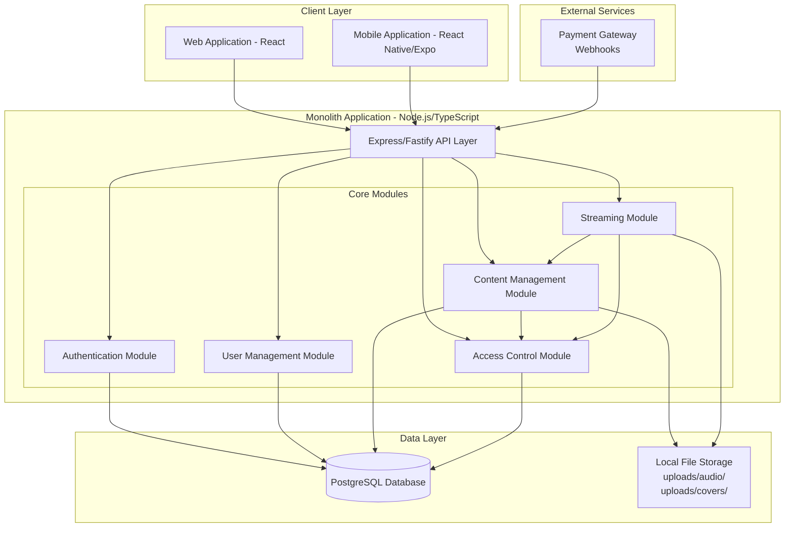

# Design Document: Music Streaming Platform

## Overview

La plataforma de streaming de música exclusiva es un sistema multi-tenant que permite a creadores transmitir contenido musical a suscriptores mediante códigos de acceso vinculados a pagos. El sistema está construido con TypeScript/Node.js y sigue una arquitectura de monolito modular con separación clara entre módulos internos, manteniendo interfaces bien definidas que facilitan futura extracción a microservicios si es necesario.

### Key Design Decisions

1. **Modular Monolith Architecture**: Aplicación única con módulos claramente separados (Authentication, User Management, Content, Access Control, Streaming) que se comunican a través de interfaces bien definidas
2. **Single Database with Schema Organization**: PostgreSQL único con tablas organizadas por dominio, facilitando consultas cross-module y transacciones ACID
3. **Token-based Authentication**: JWT para autenticación stateless compatible con web y mobile
4. **Streaming Protocol**: HTTP Live Streaming (HLS) para compatibilidad universal y adaptive bitrate
5. **API-First Design**: RESTful API que sirve tanto a clientes web como mobile
6. **Local File Storage for MVP**: Sistema de archivos local para audio files con path claro hacia S3/CDN en producción
7. **Simplified Deployment**: Single Node.js process con Express/Fastify, fácil de desarrollar y debuggear

## Architecture

### High-Level Architecture



### Technology Stack

**Backend**

- Runtime: Node.js 18+
- Framework: Express.js or Fastify
- Language: TypeScript
- Database: PostgreSQL 14+
- ORM: Prisma or TypeORM
- Authentication: jsonwebtoken + bcrypt
- File Upload: multer
- Streaming: Custom HLS implementation

**Frontend**

- Web: React + TypeScript + Vite
- Mobile: React Native + Expo
- State Management: React Query + Zustand
- UI Components: Tailwind CSS (web) + NativeWind (mobile)

**Development**

- Package Manager: pnpm
- Testing: Jest + fast-check
- Linting: ESLint + Prettier
- API Documentation: OpenAPI/Swagger

**Deployment (MVP)**

- Single VPS or cloud instance
- PM2 for process management
- Nginx as reverse proxy
- PostgreSQL on same instance
- Local file storage with backup strategy

### Module Responsibilities

**Authentication Module** (`src/modules/auth/`)

- User registration and login
- JWT token generation and validation
- Password management and reset
- Session management
- Middleware for route protection

**User Management Module** (`src/modules/users/`)

- Creator profile management
- Subscriber profile management
- Creator-subscriber relationship tracking
- User analytics and reporting
- User discovery and search

**Content Management Module** (`src/modules/content/`)

- Audio file upload and storage
- Content metadata management
- Playlist and collection organization
- File validation and processing
- Cover art management

**Access Control Module** (`src/modules/access/`)

- Access code generation and validation
- Payment webhook handling
- Access permission verification
- Code redemption tracking
- Access grant lifecycle management

**Streaming Module** (`src/modules/streaming/`)

- Audio content delivery via HLS
- Stream session management
- Manifest generation
- Streaming analytics
- Bandwidth optimization

### Project Structure

```
music-streaming-platform/
├── src/
│   ├── modules/
│   │   ├── auth/
│   │   │   ├── auth.service.ts
│   │   │   ├── auth.controller.ts
│   │   │   ├── auth.middleware.ts
│   │   │   ├── auth.types.ts
│   │   │   └── auth.test.ts
│   │   ├── users/
│   │   │   ├── users.service.ts
│   │   │   ├── users.controller.ts
│   │   │   ├── users.types.ts
│   │   │   └── users.test.ts
│   │   ├── content/
│   │   │   ├── content.service.ts
│   │   │   ├── content.controller.ts
│   │   │   ├── content.types.ts
│   │   │   └── content.test.ts
│   │   ├── access/
│   │   │   ├── access.service.ts
│   │   │   ├── access.controller.ts
│   │   │   ├── access.types.ts
│   │   │   └── access.test.ts
│   │   └── streaming/
│   │       ├── streaming.service.ts
│   │       ├── streaming.controller.ts
│   │       ├── streaming.types.ts
│   │       └── streaming.test.ts
│   ├── shared/
│   │   ├── database/
│   │   │   ├── client.ts
│   │   │   ├── migrations/
│   │   │   └── schema.prisma
│   │   ├── errors/
│   │   │   ├── AppError.ts
│   │   │   └── errorHandler.ts
│   │   ├── utils/
│   │   │   ├── logger.ts
│   │   │   ├── validation.ts
│   │   │   └── crypto.ts
│   │   └── types/
│   │       └── common.types.ts
│   ├── api/
│   │   ├── routes/
│   │   │   ├── auth.routes.ts
│   │   │   ├── users.routes.ts
│   │   │   ├── content.routes.ts
│   │   │   ├── access.routes.ts
│   │   │   └── streaming.routes.ts
│   │   └── app.ts
│   ├── config/
│   │   ├── database.ts
│   │   ├── jwt.ts
│   │   └── storage.ts
│   └── server.ts
├── uploads/
│   ├── audio/
│   ├── covers/
│   └── avatars/
├── tests/
│   ├── integration/
│   └── property/
├── package.json
├── tsconfig.json
├── .env.example
└── README.md
```

### Module Communication Patterns

**Direct Function Calls**

- Modules communicate through exported service functions
- Type-safe interfaces ensure contract compliance
- Example: `ContentModule` calls `AccessModule.validateAccess()`

**Shared Database Access**

- All modules access the same PostgreSQL database
- Each module owns specific tables (logical separation)
- Cross-module queries possible for complex operations

**Event Emitters (Optional)**

- For decoupled notifications (e.g., "content uploaded", "access granted")
- Useful for analytics and audit logging
- Not required for core functionality

**Benefits of Modular Monolith**

- Simplified development and debugging (single process)
- ACID transactions across modules
- No network latency between modules
- Easy to refactor and test
- Clear path to microservices if needed (modules already separated)

## Components and Interfaces

### Authentication Service

```typescript
interface AuthenticationService {
  // User registration
  register(credentials: UserCredentials): Promise<AuthResult>;

  // User login
  login(credentials: LoginCredentials): Promise<AuthToken>;

  // Token validation
  validateToken(token: string): Promise<TokenValidation>;

  // Password management
  resetPassword(email: string): Promise<void>;
  changePassword(
    userId: string,
    oldPassword: string,
    newPassword: string,
  ): Promise<void>;
}

interface UserCredentials {
  email: string;
  password: string;
  userType: "creator" | "subscriber";
  profile: UserProfile;
}

interface LoginCredentials {
  email: string;
  password: string;
}

interface AuthToken {
  token: string;
  expiresAt: Date;
  userId: string;
  userType: "creator" | "subscriber";
}

interface TokenValidation {
  valid: boolean;
  userId?: string;
  userType?: "creator" | "subscriber";
}

interface UserProfile {
  displayName: string;
  bio?: string;
  avatarUrl?: string;
}
```

### User Management Service

```typescript
interface UserManagementService {
  // Creator operations
  getCreatorProfile(creatorId: string): Promise<CreatorProfile>;
  updateCreatorProfile(
    creatorId: string,
    updates: Partial<CreatorProfile>,
  ): Promise<CreatorProfile>;
  getCreatorSubscribers(creatorId: string): Promise<Subscriber[]>;
  revokeSubscriberAccess(
    creatorId: string,
    subscriberId: string,
  ): Promise<void>;

  // Subscriber operations
  getSubscriberProfile(subscriberId: string): Promise<SubscriberProfile>;
  updateSubscriberProfile(
    subscriberId: string,
    updates: Partial<SubscriberProfile>,
  ): Promise<SubscriberProfile>;
  getSubscriberAccessList(subscriberId: string): Promise<CreatorAccess[]>;

  // Discovery
  listCreators(filters?: CreatorFilters): Promise<CreatorPreview[]>;
  searchCreators(query: string): Promise<CreatorPreview[]>;
}

interface CreatorProfile {
  id: string;
  displayName: string;
  bio: string;
  avatarUrl: string;
  genres: string[];
  createdAt: Date;
  subscriberCount: number;
}

interface SubscriberProfile {
  id: string;
  displayName: string;
  avatarUrl: string;
  joinedAt: Date;
  activeAccessCount: number;
}

interface Subscriber {
  id: string;
  displayName: string;
  accessGrantedAt: Date;
  accessExpiresAt: Date | null;
  isActive: boolean;
}

interface CreatorAccess {
  creatorId: string;
  creatorName: string;
  accessGrantedAt: Date;
  accessExpiresAt: Date | null;
  isActive: boolean;
}

interface CreatorPreview {
  id: string;
  displayName: string;
  bio: string;
  avatarUrl: string;
  genres: string[];
  subscriberCount: number;
  hasAccess: boolean;
}

interface CreatorFilters {
  genre?: string;
  sortBy?: "popularity" | "recent" | "name";
}
```

### Content Management Service

```typescript
interface ContentManagementService {
  // Content upload and management
  uploadContent(
    creatorId: string,
    file: AudioFile,
    metadata: ContentMetadata,
  ): Promise<Content>;
  updateContent(
    contentId: string,
    updates: Partial<ContentMetadata>,
  ): Promise<Content>;
  deleteContent(contentId: string): Promise<void>;

  // Content retrieval
  getContent(contentId: string): Promise<Content>;
  getCreatorLibrary(creatorId: string): Promise<Content[]>;

  // Playlist management
  createPlaylist(creatorId: string, playlist: PlaylistData): Promise<Playlist>;
  updatePlaylist(
    playlistId: string,
    updates: Partial<PlaylistData>,
  ): Promise<Playlist>;
  deletePlaylist(playlistId: string): Promise<void>;
  getCreatorPlaylists(creatorId: string): Promise<Playlist[]>;
}

interface AudioFile {
  buffer: Buffer;
  mimeType: string;
  originalName: string;
}

interface ContentMetadata {
  title: string;
  description?: string;
  genre: string;
  duration: number;
  coverArtUrl?: string;
  tags: string[];
}

interface Content {
  id: string;
  creatorId: string;
  title: string;
  description: string;
  genre: string;
  duration: number;
  coverArtUrl: string;
  tags: string[];
  streamUrl: string;
  uploadedAt: Date;
  playCount: number;
}

interface PlaylistData {
  name: string;
  description?: string;
  contentIds: string[];
  coverArtUrl?: string;
}

interface Playlist {
  id: string;
  creatorId: string;
  name: string;
  description: string;
  contentIds: string[];
  coverArtUrl: string;
  createdAt: Date;
  updatedAt: Date;
}
```

### Access Control Service

```typescript
interface AccessControlService {
  // Access code management
  generateAccessCode(payment: PaymentData): Promise<AccessCode>;
  redeemAccessCode(subscriberId: string, code: string): Promise<AccessGrant>;
  validateAccess(subscriberId: string, creatorId: string): Promise<boolean>;
  invalidateAccessCode(code: string): Promise<void>;

  // Payment webhook handling
  handlePaymentWebhook(payload: PaymentWebhook): Promise<void>;

  // Access queries
  getSubscriberAccess(subscriberId: string): Promise<AccessGrant[]>;
  getCreatorSubscribers(creatorId: string): Promise<AccessGrant[]>;
}

interface PaymentData {
  creatorId: string;
  amount: number;
  currency: string;
  paymentId: string;
  duration: number; // days of access
}

interface AccessCode {
  code: string;
  creatorId: string;
  expiresAt: Date | null;
  isRedeemed: boolean;
  createdAt: Date;
}

interface AccessGrant {
  id: string;
  subscriberId: string;
  creatorId: string;
  accessCode: string;
  grantedAt: Date;
  expiresAt: Date | null;
  isActive: boolean;
}

interface PaymentWebhook {
  eventType: "payment.success" | "payment.failed" | "payment.refunded";
  paymentId: string;
  creatorId: string;
  amount: number;
  currency: string;
  metadata: Record<string, any>;
}
```

### Streaming Service

```typescript
interface StreamingService {
  // Stream initialization
  initializeStream(
    subscriberId: string,
    contentId: string,
  ): Promise<StreamSession>;

  // Stream delivery
  getStreamManifest(sessionId: string): Promise<HLSManifest>;
  getStreamSegment(sessionId: string, segmentId: string): Promise<Buffer>;

  // Session management
  endStream(sessionId: string): Promise<StreamAnalytics>;
  getActiveStreams(subscriberId: string): Promise<StreamSession[]>;
}

interface StreamSession {
  id: string;
  subscriberId: string;
  contentId: string;
  creatorId: string;
  startedAt: Date;
  manifestUrl: string;
  expiresAt: Date;
}

interface HLSManifest {
  version: number;
  targetDuration: number;
  segments: StreamSegment[];
}

interface StreamSegment {
  id: string;
  duration: number;
  url: string;
}

interface StreamAnalytics {
  sessionId: string;
  duration: number;
  bytesTransferred: number;
  completionPercentage: number;
  endedAt: Date;
}
```

## Data Models

### Database Schema (PostgreSQL)

La aplicación utiliza una única base de datos PostgreSQL con tablas organizadas por dominio funcional. Todas las tablas están en el mismo schema pero agrupadas lógicamente para mantener la separación de responsabilidades.

#### Users Domain

```typescript
// users table
interface UserRecord {
  id: string; // UUID, primary key
  email: string; // unique, not null
  passwordHash: string; // not null
  userType: "creator" | "subscriber"; // not null
  displayName: string; // not null
  bio: string | null;
  avatarUrl: string | null;
  createdAt: Date; // default now()
  updatedAt: Date; // default now()
  isActive: boolean; // default true
}

// creator_profiles table
interface CreatorRecord {
  userId: string; // UUID, primary key, FK to users(id)
  genres: string[]; // array, default []
  subscriberCount: number; // default 0
  totalStreams: number; // default 0
  totalRevenue: number; // default 0
  updatedAt: Date; // default now()
}

// subscriber_profiles table
interface SubscriberRecord {
  userId: string; // UUID, primary key, FK to users(id)
  activeAccessCount: number; // default 0
  totalStreams: number; // default 0
  updatedAt: Date; // default now()
}
```

#### Content Domain

```typescript
// content table
interface ContentRecord {
  id: string; // UUID, primary key
  creatorId: string; // FK to users(id), not null
  title: string; // not null
  description: string | null;
  genre: string; // not null
  duration: number; // seconds, not null
  coverArtUrl: string | null;
  tags: string[]; // array, default []
  fileStoragePath: string; // local file path, not null
  streamUrl: string; // HLS manifest URL, not null
  uploadedAt: Date; // default now()
  playCount: number; // default 0
  isActive: boolean; // default true
}

// playlists table
interface PlaylistRecord {
  id: string; // UUID, primary key
  creatorId: string; // FK to users(id), not null
  name: string; // not null
  description: string | null;
  coverArtUrl: string | null;
  createdAt: Date; // default now()
  updatedAt: Date; // default now()
  isActive: boolean; // default true
}

// playlist_content junction table
interface PlaylistContentRecord {
  playlistId: string; // FK to playlists(id), not null
  contentId: string; // FK to content(id), not null
  position: number; // not null
  addedAt: Date; // default now()
  // Primary key: (playlistId, contentId)
}
```

#### Access Control Domain

```typescript
// access_codes table
interface AccessCodeRecord {
  code: string; // unique, primary key
  creatorId: string; // FK to users(id), not null
  paymentId: string; // unique, not null
  amount: number; // not null
  currency: string; // not null
  durationDays: number; // not null
  expiresAt: Date | null;
  isRedeemed: boolean; // default false
  redeemedBy: string | null; // FK to users(id)
  redeemedAt: Date | null;
  createdAt: Date; // default now()
  isValid: boolean; // default true
}

// access_grants table
interface AccessGrantRecord {
  id: string; // UUID, primary key
  subscriberId: string; // FK to users(id), not null
  creatorId: string; // FK to users(id), not null
  accessCode: string; // FK to access_codes(code), not null
  grantedAt: Date; // default now()
  expiresAt: Date | null;
  isActive: boolean; // default true
  revokedAt: Date | null;
  revokedBy: string | null; // FK to users(id)
  // Index: (subscriberId, creatorId) for fast access checks
}
```

#### Streaming Domain

```typescript
// stream_sessions table
interface StreamSessionRecord {
  id: string; // UUID, primary key
  subscriberId: string; // FK to users(id), not null
  contentId: string; // FK to content(id), not null
  creatorId: string; // FK to users(id), not null
  startedAt: Date; // default now()
  endedAt: Date | null;
  duration: number; // seconds, default 0
  bytesTransferred: number; // default 0
  completionPercentage: number; // default 0
  // Index: (subscriberId), (contentId), (creatorId) for analytics
}
```

### Database Indexes

```sql
-- Users domain
CREATE INDEX idx_users_email ON users(email);
CREATE INDEX idx_users_type ON users(userType);

-- Content domain
CREATE INDEX idx_content_creator ON content(creatorId);
CREATE INDEX idx_content_genre ON content(genre);
CREATE INDEX idx_content_active ON content(isActive);
CREATE INDEX idx_playlists_creator ON playlists(creatorId);

-- Access control domain
CREATE INDEX idx_access_codes_creator ON access_codes(creatorId);
CREATE INDEX idx_access_codes_payment ON access_codes(paymentId);
CREATE INDEX idx_access_grants_subscriber ON access_grants(subscriberId);
CREATE INDEX idx_access_grants_creator ON access_grants(creatorId);
CREATE INDEX idx_access_grants_active ON access_grants(subscriberId, creatorId, isActive);

-- Streaming domain
CREATE INDEX idx_stream_sessions_subscriber ON stream_sessions(subscriberId);
CREATE INDEX idx_stream_sessions_content ON stream_sessions(contentId);
CREATE INDEX idx_stream_sessions_creator ON stream_sessions(creatorId);
CREATE INDEX idx_stream_sessions_started ON stream_sessions(startedAt);
```

### File Storage Structure

```
uploads/
├── audio/
│   ├── {creatorId}/
│   │   ├── {contentId}/
│   │   │   ├── original.mp3
│   │   │   ├── manifest.m3u8
│   │   │   └── segments/
│   │   │       ├── segment-0.ts
│   │   │       ├── segment-1.ts
│   │   │       └── ...
├── covers/
│   ├── {creatorId}/
│   │   ├── {contentId}.jpg
│   │   └── ...
│   └── playlists/
│       ├── {playlistId}.jpg
│       └── ...
└── avatars/
    ├── {userId}.jpg
    └── ...
```

## Correctness Properties

_A property is a characteristic or behavior that should hold true across all valid executions of a system—essentially, a formal statement about what the system should do. Properties serve as the bridge between human-readable specifications and machine-verifiable correctness guarantees._

### Creator Management Properties

**Property 1: Unique creator account creation**
_For any_ valid creator credentials, registration should create an account with a unique identifier that differs from all existing account identifiers.
**Validates: Requirements 1.1**

**Property 2: Profile update persistence (Round-trip)**
_For any_ creator profile update, reading the profile immediately after the update should return the updated values.
**Validates: Requirements 1.2**

**Property 3: Empty library initialization**
_For any_ newly created creator account, querying their content library should return an empty collection.
**Validates: Requirements 1.4**

### Access Code System Properties

**Property 4: Valid code redemption grants access**
_For any_ valid access code and subscriber, redeeming the code should result in the subscriber having access to the associated creator's content library.
**Validates: Requirements 2.1**

**Property 5: Invalid codes are rejected**
_For any_ invalid or expired access code, redemption attempts should be rejected with a descriptive error message.
**Validates: Requirements 2.2**

**Property 6: Redemption tracking**
_For any_ redeemed access code, querying the access grant should return a record with a redemption timestamp and the subscriber association.
**Validates: Requirements 2.3**

**Property 7: Single-use access codes**
_For any_ access code, after successful redemption by one subscriber, attempts to redeem the same code by a different subscriber should fail.
**Validates: Requirements 2.4**

**Property 8: Access-based authorization**
_For any_ subscriber with active access to a creator, streaming requests for that creator's content should be authorized; for any subscriber without active access, streaming requests should be denied.
**Validates: Requirements 2.5**

### Multi-Tenant Properties

**Property 9: Creator data isolation**
_For any_ two distinct creators, their content libraries should not overlap, and modifications to one creator's library should not affect the other creator's library.
**Validates: Requirements 3.1**

**Property 10: Access-filtered content visibility**
_For any_ subscriber, querying available content should return only content from creators for which the subscriber has valid active access.
**Validates: Requirements 3.2, 3.4**

**Property 11: Multiple simultaneous access grants**
_For any_ subscriber, redeeming valid access codes for multiple different creators should result in all access grants remaining active simultaneously.
**Validates: Requirements 3.3**

### Audio Streaming Properties

**Property 12: Stream authorization based on access**
_For any_ content and subscriber, stream requests should succeed if and only if the subscriber has valid active access to the content's creator.
**Validates: Requirements 4.1, 4.2**

**Property 13: Stream session tracking**
_For any_ completed stream session, there should exist a corresponding analytics record with session details.
**Validates: Requirements 4.5**

### Content Management Properties

**Property 14: Content upload adds to library**
_For any_ creator and valid audio file with metadata, successful upload should result in the content appearing in the creator's content library.
**Validates: Requirements 5.1**

**Property 15: Content deletion removes access**
_For any_ content in a creator's library, deleting it should remove it from the library and make subsequent access attempts fail.
**Validates: Requirements 5.2**

**Property 16: Invalid format rejection**
_For any_ audio file with an unsupported format, upload attempts should be rejected with a descriptive error message.
**Validates: Requirements 5.3**

**Property 17: Metadata generation on upload**
_For any_ successfully uploaded content, the system should generate necessary streaming metadata including stream URLs.
**Validates: Requirements 5.4**

### Authentication Properties

**Property 18: Valid credentials issue tokens**
_For any_ valid user credentials, login should return a secure session token with an expiration time.
**Validates: Requirements 6.1**

**Property 19: Invalid credentials are rejected**
_For any_ invalid user credentials, login attempts should fail and return an authentication error.
**Validates: Requirements 6.2**

**Property 20: Password complexity enforcement**
_For any_ password that does not meet complexity requirements, registration should be rejected with a descriptive error.
**Validates: Requirements 6.3**

**Property 21: Expired token rejection**
_For any_ expired session token, API requests using that token should be rejected with an authentication error.
**Validates: Requirements 6.4**

### Subscriber Management Properties

**Property 22: Subscriber list accuracy**
_For any_ creator, the subscriber list should contain exactly those subscribers who have active access grants to that creator's content.
**Validates: Requirements 7.1**

**Property 23: Subscriber information completeness**
_For any_ subscriber in a creator's subscriber list, the returned data should include access status and redemption date.
**Validates: Requirements 7.2**

**Property 24: Access revocation enforcement**
_For any_ subscriber whose access has been revoked by a creator, subsequent streaming requests for that creator's content should be denied.
**Validates: Requirements 7.3**

### API Consistency Properties

**Property 25: JSON response format consistency**
_For any_ API endpoint response, the response should be valid JSON with a consistent structure including status, data, and error fields.
**Validates: Requirements 8.2**

### Payment Integration Properties

**Property 26: Unique access code generation**
_For any_ successful payment, the system should generate an access code with a unique value that differs from all existing codes.
**Validates: Requirements 9.1**

**Property 27: Access code association**
_For any_ generated access code, querying the code should return the associated creator ID and payment details.
**Validates: Requirements 9.2**

**Property 28: Expiration date calculation**
_For any_ payment with a specified duration, the generated access code should have an expiration date equal to the creation date plus the duration.
**Validates: Requirements 9.3**

**Property 29: Failed payment invalidation**
_For any_ failed or refunded payment, the associated access code should be marked as invalid and redemption attempts should fail.
**Validates: Requirements 9.4**

### Content Discovery Properties

**Property 30: Creator preview information completeness**
_For any_ creator in discovery results, the returned data should include profile information, genres, and access status for the requesting subscriber.
**Validates: Requirements 10.2**

**Property 31: Search result relevance**
_For any_ creator search with filters (genre, name), all returned results should match the specified filter criteria.
**Validates: Requirements 10.3**

**Property 32: Access status indication**
_For any_ subscriber viewing creator listings, each creator should be marked with whether the subscriber currently has active access.
**Validates: Requirements 10.4**

## Error Handling

### Error Categories

**Authentication Errors**

- Invalid credentials (401 Unauthorized)
- Expired token (401 Unauthorized)
- Missing token (401 Unauthorized)
- Insufficient permissions (403 Forbidden)

**Authorization Errors**

- No active access to creator content (403 Forbidden)
- Revoked access (403 Forbidden)
- Invalid or expired access code (400 Bad Request)

**Validation Errors**

- Invalid email format (400 Bad Request)
- Weak password (400 Bad Request)
- Unsupported audio format (400 Bad Request)
- Missing required fields (400 Bad Request)

**Resource Errors**

- User not found (404 Not Found)
- Content not found (404 Not Found)
- Creator not found (404 Not Found)
- Duplicate email (409 Conflict)
- Access code already redeemed (409 Conflict)

**Server Errors**

- Database connection failure (500 Internal Server Error)
- File storage failure (500 Internal Server Error)
- External service timeout (503 Service Unavailable)

### Error Response Format

All errors follow a consistent JSON structure:

```typescript
interface ErrorResponse {
  status: "error";
  code: string; // Machine-readable error code
  message: string; // Human-readable error message
  details?: Record<string, any>; // Additional context
  timestamp: string; // ISO 8601 timestamp
}
```

### Error Handling Strategies

**Retry Logic**

- Transient failures (network, timeout) should be retried with exponential backoff
- Maximum 3 retry attempts for idempotent operations
- Non-idempotent operations (payments, code redemption) should not auto-retry

**Graceful Degradation**

- If file storage is temporarily unavailable, return cached content list
- If analytics recording fails, log error but don't block primary operations
- If email service fails during password reset, queue for later retry

**Transaction Management**

- Access code redemption is atomic (code marked as redeemed + access grant created) using database transactions
- Content deletion is atomic (file removed + database record deleted) with rollback on failure
- Payment webhook processing uses idempotency keys to prevent duplicate processing

**Module-Level Error Handling**

- Each module exports typed error classes (e.g., `AuthenticationError`, `AccessDeniedError`)
- API layer catches module errors and converts to HTTP responses
- Errors include context for debugging (user ID, resource ID, operation attempted)
- Sensitive information (passwords, tokens) never included in error responses

## Testing Strategy

### Dual Testing Approach

This system requires both unit testing and property-based testing for comprehensive coverage:

**Unit Tests** focus on:

- Specific examples of correct behavior
- Edge cases (empty inputs, boundary values)
- Error conditions and error messages
- Integration points between services
- Mock external dependencies (payment gateway, file storage)

**Property-Based Tests** focus on:

- Universal properties that hold for all inputs
- Comprehensive input coverage through randomization
- Invariants that must be maintained
- Round-trip properties (encode/decode, create/retrieve)

### Property-Based Testing Configuration

**Library Selection**: Use `fast-check` for TypeScript property-based testing

**Test Configuration**:

- Minimum 100 iterations per property test
- Each test tagged with: `Feature: music-streaming-platform, Property {N}: {property_text}`
- Custom generators for domain objects (User, Content, AccessCode, etc.)

**Example Property Test Structure**:

```typescript
import fc from "fast-check";

// Feature: music-streaming-platform, Property 2: Profile update persistence
test("Profile update round-trip", async () => {
  await fc.assert(
    fc.asyncProperty(
      fc.record({
        displayName: fc.string({ minLength: 1, maxLength: 100 }),
        bio: fc.option(fc.string({ maxLength: 500 })),
        genres: fc.array(fc.string(), { minLength: 1, maxLength: 5 }),
      }),
      async (profileUpdate) => {
        const creator = await createTestCreator();
        await userService.updateCreatorProfile(creator.id, profileUpdate);
        const retrieved = await userService.getCreatorProfile(creator.id);

        expect(retrieved.displayName).toBe(profileUpdate.displayName);
        expect(retrieved.bio).toBe(profileUpdate.bio);
        expect(retrieved.genres).toEqual(profileUpdate.genres);
      },
    ),
    { numRuns: 100 },
  );
});
```

### Unit Testing Strategy

**Service Layer Tests**:

- Test each service method with specific examples
- Mock database and external dependencies
- Verify error handling and edge cases

**Integration Tests**:

- Test API endpoints end-to-end
- Use test database with fixtures
- Verify request/response formats
- Test authentication and authorization flows

**Example Unit Test**:

```typescript
describe("AccessControlService", () => {
  test("should reject already redeemed access code", async () => {
    const code = await createTestAccessCode();
    const subscriber1 = await createTestSubscriber();
    const subscriber2 = await createTestSubscriber();

    // First redemption should succeed
    await accessService.redeemAccessCode(subscriber1.id, code.code);

    // Second redemption should fail
    await expect(
      accessService.redeemAccessCode(subscriber2.id, code.code),
    ).rejects.toThrow("Access code already redeemed");
  });
});
```

### Test Coverage Goals

- Unit test coverage: minimum 80% of service layer code
- Property tests: one test per correctness property (32 properties)
- Integration tests: all API endpoints covered
- Error scenarios: all error types tested

### Testing Tools

- **Test Framework**: Jest
- **Property Testing**: fast-check
- **API Testing**: supertest
- **Database**: In-memory PostgreSQL for tests
- **Mocking**: jest.mock for external services
